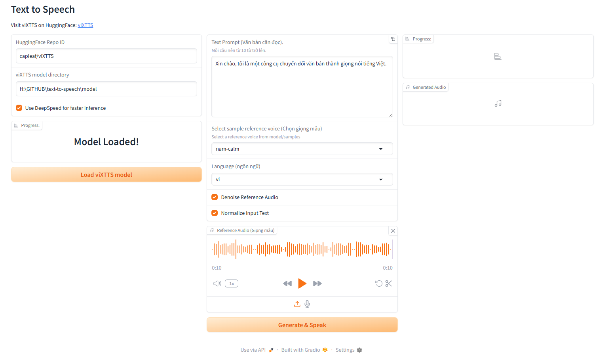

# viXTTS Demo 🗣️🔥

## Sử dụng nhanh ✨

👉 Truy cập <https://huggingface.co/spaces/thinhlpg/vixtts-demo> để dùng ngay mà không cần cài đặt.

## Introduction 👋

viXTTS is a text-to-speech voice generation tool that offers voice cloning voices in Vietnamese and other languages. This model is a fine-tuned version based on the [XTTS-v2.0.3](https://huggingface.co/coqui/XTTS-v2) model, utilizing the [viVoice](https://huggingface.co/datasets/capleaf/viVoice) dataset. This repository is primarily intended for demostration purposes.

The model can be accessed at: [viXTTS on Hugging Face](https://huggingface.co/capleaf/viXTTS)

## Online usage (Recommended)

- You can try the model here: <https://huggingface.co/spaces/thinhlpg/vixtts-demo>
- For a quick demonstration, please refer to [this notebook](./viXTTS_Demo.ipynb) on Google Colab.
Tutorial (Vietnamese): <https://youtu.be/pbwEbpOy0m8?feature=shared>


## Local Usage

This code is specifically designed for running on Ubuntu or WSL2. It is not intended for use on macOS or Windows systems.


### Hardware Recommendations

- At least 10GB of free disk space
- At least 16GB of RAM
- **Nvidia GPU** with a minimum of 4GB of VRAM
- By default, the model will utilize the GPU. In the absence of a GPU, it will run on the CPU and run much slower.

### Required Software

- Git
- Python version >=3.9 and <= 3.11. The default version is set to 3.11, but you can modify the Python version in the `run.sh` file.

### Usage
#### On Linux
```bash
git clone https://github.com/Min9802/text-to-speech
cd text-to-speech
./run.sh
```
#### On Windows with command prompt (or onclick run.bat in resources)
```bash
git clone https://github.com/Min9802/text-to-speech
cd text-to-speech
cmd /c run.bat
```

1. Run `run.sh` (dependencies will be automatically installed for the first run).
2. Access the Gradio demo link.
3. Load the model and wait for it to load.
4. Inference and Enjoy 🤗
5. The result will be saved in `output/`

## Limitation

- Subpar performance for input sentences under 10 words in Vietnamese language (yielding inconsistent output and odd trailing sounds).
- This model is only fine-tuned in Vietnamese. The model's effectiveness with languages other than Vietnamese hasn't been tested, potentially reducing quality.

## Contributions

This project is not being actively maintained, and I do not plan to release the finetuning code due to sensitive reasons, as it might be used for unethical purposes. If you want to contribute by creating versions for other operating systems, such as Windows or macOS, please fork the repository, create a new branch, test thoroughly on the respective OS, and submit a pull request specifying your contributions.

## Acknowledgements

We would like to express our gratitude to all libraries, and resources that have played a role in the development of this demo, especially:

- [Coqui TTS](https://github.com/coqui-ai/TTS) for XTTS foundation model and inference code
- [Vinorm](https://github.com/v-nhandt21/Vinorm) and [Undethesea](https://github.com/undertheseanlp/underthesea) for Vietnamese text normalization
- [Deepspeed](https://github.com/microsoft/DeepSpeed) for fast inference
- [Huggingface Hub](https://huggingface.co/) for hosting the model
- [Gradio](https://www.gradio.app/) for web UI
- [DeepFilterNet](https://github.com/Rikorose/DeepFilterNet) for noise removal

## Citation

```bibtex
@misc{viVoice,
  author = {Thinh Le Phuoc Gia, Tuan Pham Minh, Hung Nguyen Quoc, Trung Nguyen Quoc, Vinh Truong Hoang},
  title = {viVoice: Enabling Vietnamese Multi-Speaker Speech Synthesis},
  url = {https://github.com/thinhlpg/viVoice},
  year = {2024}
}
```

A manuscript and a friendly dev log documenting the process might be made available later (including other works that were experimented with, but details about the filtering process are not specified in this README file).

## Contact 💬

- Facebook: <https://fb.com/thinhlpg/> (preferred; feel free to add friend and message me casually)
- GitHub: <https://github.com/thinhlpg>
- Email: <thinhlpg@gmail.com> (please don't; I prefer friendly, casual talk 💀)
